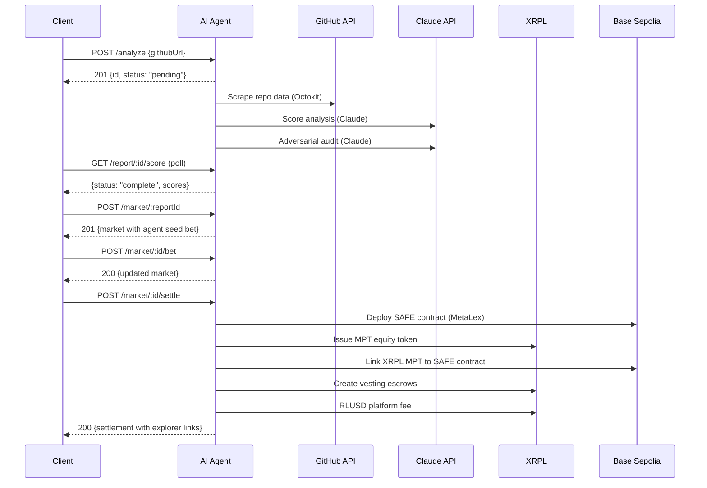

## The Pipeline

Lapis processes startups in three stages: **analyze**, **market**, and **settle**. Each stage builds on the previous one.



## Stage 1: Analysis

When you `POST /analyze`, the agent kicks off a background pipeline:

1. **GitHub scraping** — Stars, forks, commits, contributors, languages, CI presence (via Octokit)
2. **Social scraping** — Twitter followers, engagement (currently mocked)
3. **Polymarket sentiment** — Real API call to fetch market sentiment (non-critical, pipeline continues if it fails)
4. **Claude scoring** — Evaluates code quality, team strength, traction, and social presence on a 0-100 scale
5. **Adversarial audit** — Second Claude call that challenges the initial scores, flags red flags, and produces a trust score

The report status progresses: `pending` → `scraping` → `analyzing` → `complete` (or `error`).

<Info>
  Steps 3-5 are non-critical. If Polymarket or the adversarial audit fails, the pipeline still completes with the primary scores.
</Info>

## Stage 2: Prediction Market

Once analysis is complete, a prediction market can be opened:

1. **Agent seeds the market** with an initial valuation estimate based on the overall score
2. **Participants place bets** — each bet includes a valuation (in millions USD) and an amount (bet size)
3. **Consensus forms** — The consensus valuation is the volume-weighted average of all bets

### Valuation Estimation

The agent's seed valuation maps the overall score (0-100) to a $0.5M–$50M range using an exponential curve:

```
valuation = $0.5M * 1.05^(overallScore)
```

A score of 50 maps to ~$5.7M. A score of 90 maps to ~$44M.

## Stage 3: XRPL Settlement

Settlement converts the market consensus into real on-chain equity across two chains:

1. **Deploy SAFE** (optional) — If `BASE_PRIVATE_KEY` is configured, deploys a MetaLex SAFE agreement on Base Sepolia with company metadata, valuation cap, and equity percentage
2. **Close market** — Finalizes the consensus valuation
3. **Issue MPT** — Creates an equity token (MPTokenIssuanceCreate) with company metadata, auth requirements, and transfer fees. Embeds the SAFE contract address and document hash in MPT metadata
4. **Cross-chain link** — Links the XRPL MPT issuance ID back to the Base contract and marks the SAFE as settled on-chain
5. **Escrow shares** — For each participant (max 5 for demo), creates a vesting escrow with a 90-day cliff and crypto-condition
6. **RLUSD fee** — Sets up a trust line and sends a 2.5% platform fee in RLUSD

<Warning>
  On testnet, RLUSD payments will fail with `tecPATH_DRY` because wallets don't have RLUSD balance. This is expected. The settlement still completes — RLUSD is non-critical.
</Warning>

## Monitoring (Agentic Loop)

After settlement, the agent can continuously monitor the repo:

- Checks for new commits, star changes, and contributor changes on a configurable interval
- Re-analyzes the repo if changes are detected
- Auto-adjusts market positions when scores shift significantly
- Triggers XRPL hooks on score drops greater than 15 points
