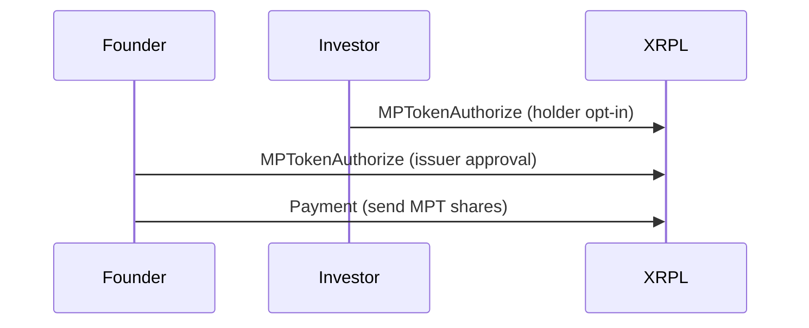

## Overview

Every financial primitive in Lapis maps to a native XRPL transaction type — no smart contract language, no gas fees, 3-5 second finality on testnet.

## XRPL Primitives Used

| Lapis Concept | XRPL Transaction | Purpose |
|---------------|-------------------|---------|
| Report paywall | `Payment` + `verifyPayment` | XRPL micropayment (0.05 XRP) for report access |
| Equity token | `MPTokenIssuanceCreate` | Issue shares representing startup equity |
| Investor authorization | `MPTokenAuthorize` | KYC/accreditation gate per investor |
| Vesting lock | `EscrowCreate` | Lock shares with time or condition-based release |
| Vest release | `EscrowFinish` | Release shares when conditions are met |
| Platform fee | `Payment` (RLUSD) | 2.5% fee via stablecoin |
| Legal anchor | MetaLex SAFE (Base Sepolia) | Legally binding agreement linked to MPT |

## Equity Tokens (MPT)

When a market settles, the founder issues an MPT (Multi-Purpose Token) representing equity in the company.

### Token Flags

These flags are set at issuance and are **irreversible** after the first holder opts in:

| Flag | Effect |
|------|--------|
| `tfMPTRequireAuth` | Founder must authorize each investor (compliance gate) |
| `tfMPTCanEscrow` | Shares can be locked in vesting escrows |
| `tfMPTCanLock` | Founder can freeze individual holdings if needed |
| `tfMPTCanTransfer` | Whether shares can trade on secondary market |
| `tfMPTCanTrade` | Whether shares can list on XRPL DEX |
| `TransferFee` | Royalty on every secondary transfer (0-50000 bps) |

### Holder Onboarding Flow



<Warning>
  The holder must opt-in **before** the founder authorizes them. Reversing this order results in `tecOBJECT_NOT_FOUND`.
</Warning>

## Vesting Escrows

Shares are locked in escrow immediately after issuance. Two release mechanisms are supported:

### Time-Based (Vesting Cliff)

```
FinishAfter = rippleTime(cliff date)    // e.g., 90 days from settlement
CancelAfter = rippleTime(safety expiry) // e.g., 365 days
```

Anyone can call `EscrowFinish` after `FinishAfter` — no human unlock required.

### Condition-Based (Conversion Trigger)

```
Condition = PREIMAGE-SHA-256 crypto-condition
Fulfillment = preimage held by AI agent
```

The agent holds the fulfillment preimage. When a conversion event is confirmed (e.g., MetaLex SAFE settlement on Base Sepolia), the agent calls `EscrowFinish` with the fulfillment. This makes the agent a **trustless trustee**.

## Cross-Chain Legal Anchor (MetaLex)

When `BASE_PRIVATE_KEY` is configured, settlement deploys a SAFE (Simple Agreement for Future Equity) contract on Base Sepolia via MetaLex before issuing the MPT.

The SAFE contract address and document hash are embedded in the MPT's `extraMetadata` field, creating a **bidirectional link** between the on-chain equity token (XRPL) and the legal agreement (Base):

- MPT metadata contains `safeContractAddress` and `safeDocumentHash`
- Base contract stores the XRPL `mptIssuanceId` via `linkXRPL()`
- The `/safe/:marketId` endpoint verifies both sides match (`crossChainVerified`)

This means the legal agreement and the equity token are cryptographically linked across two chains — neither can exist without referencing the other.

### Default Settlement Config

| Parameter | Default | Description |
|-----------|---------|-------------|
| `totalEquityShares` | 10,000,000 | Total shares issued per company |
| `vestingCliffDays` | 90 | Days before shares can be released |
| `cancelAfterDays` | 365 | Safety expiry for unclaimed escrows |
| `platformFeeBps` | 250 | Platform fee (2.5%) |
| `royaltyBps` | 100 | Secondary transfer royalty (1%) |
| `xrpUsdRate` | 0.5 | XRP/USD conversion rate |

## Why MPT Over Trust Lines?

- **No trust line required from holder** — Lower reserve cost
- **`tfMPTRequireAuth`** — Built-in compliance gate
- **`tfMPTCanEscrow`** — Native vesting support, the key feature for equity

## Security

- `delivered_amount` is always checked over `Amount` (partial payment attack prevention)
- Wallet seeds stored in `.env`, never committed or sent over the network
- All transactions use `autofill()` for automatic `LastLedgerSequence`
- `submitAndWait()` used everywhere — never trust submission result alone
- Mainnet endpoints are config-driven via `XRPL_NETWORK`, never hardcoded
